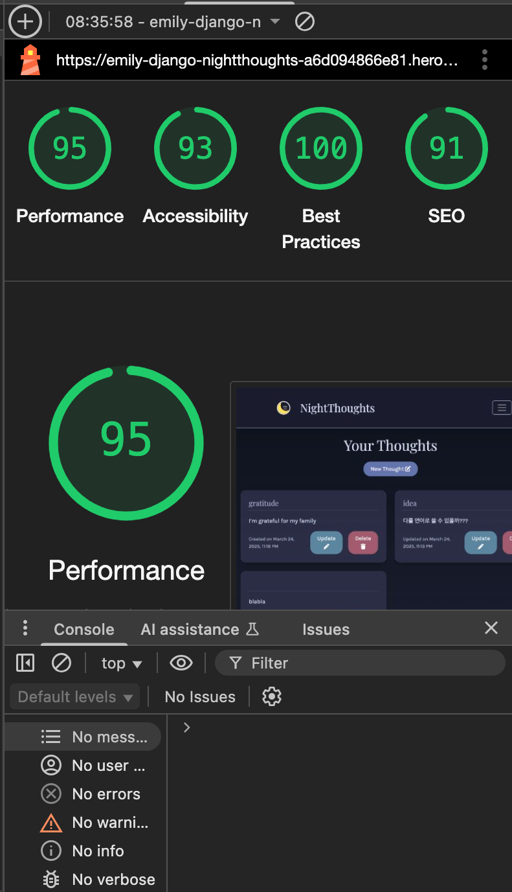

# django-NightThoughts

# Overview
This project is a journal web application built with the python-based framework Django. The front-end is HTML & CSS, Javascipt & also encorporates the Bootstrap 5 framework. There is full CRUD functionality as users can create, read, update, and delete their thoughts. The application differs from an ordinary journalling app because it is specifically designed to help users clear their mind before sleep in order to encourage mental decluttering, reduce overthinking & nighttime anxiety, but also to have a place for those genius thoughts/ideas we seem to get at night-time when our brain enters a more creative mode.

 I also wanted to address the advice of not looking at your phone before bed - with the ever increasing amount of time we engage with technology I think it's unlikely that people are going to put their phones away before bed. With that being said, I think it is at least better to encourage journalling/reflecting instead of mindlessly scrolling on social media. 

The live project can found here: <a href="https://emily-django-nightthoughts-a6d094866e81.herokuapp.com/" target="_blank">Live Project</a>

<h2 text-align="center" id="TOC">Table of Contents</h2>

- [NightThoughts](#django-NightThoughts)
  - [Overview](#overview)
  - [Table of Contents](#TOC)
  - [UX Design](#ux-design)
    - [User Stories](#user-stories)
    - [Wireframes](#wireframes)
     - [Colors](#colors)
    - [Fonts](#fonts)
- [Features](#features)
  - [Navbar](#navbar)
  - [Searchbar](#searchbar)
  - [Random Search Button](#random-search-button)
  - [Meal Cards](#meal-cards)
  - [Footer](#footer)
  - [Responsive Design](#responsive-design)
- [Deployment](#deployment)
- [Testing](#testing)
- [Content](#content)
- [Media](#media)
- [AI Implementation and Orchestration](#ai-implementation-and-orchestration)
- [Future Enhancements](#future-enhancements)
- [Collaborators](#collaborators)

## UX Design
# User stories

You can also view the user stories in the [GitHub Projects Kanban Board](https://github.com/username/project/kanban).
1) As a site user, I want to log in so that only I can access my page.

✅ Acceptance Criteria:

Given an email, username & password, a user can register an account.
Then the user can log in.
When the user is logged in they can write their thoughts down.

2) As a site user, I want to write down my thoughts (worries, ideas, to-dos) before bed so that I can clear my mind and sleep more peacefully.

✅ Acceptance Criteria:

I can enter text into a form and categorize it as a worry, idea, or to-do.

3) As a site user, I want to see my past thoughts in an organized way so that I can reflect on them when needed.
As a site user, I can view a paginated list of posts so that I can select which post I want to view.
✅ Acceptance Criteria:

I can see my thoughts listed chronologically.
When I log in, the main page is a form for me to write today's thoughts.
When I open the thoughts page, a list of my thoughts is seen.
Thoughts appear in a calming UI, not just plain text.

4) As a user, I want to edit my past thoughts so that I can take into account any change in my perspective, or if I simply want to rephrase something.

✅ Acceptance Criteria:

-I can update the text of my thoughts.
-I can change the category (e.g., a "worry" might become an "idea").

5) As a site user, I want to remove thoughts I no longer need so that I can declutter my mind and my digital journal.

✅ Acceptance Criteria:

The thought is permanently deleted from the database.

6) As a user, I want there to be a visual cue to show that I’ve clicked on a thought & reflected on it so that I can track my thoughts.

7) As a Site User, I can click on the About link so that I can read about the site.

When the About link is clicked, the about text is visible.

As a Site Admin, I can create or update the about page content so that it is available on the site.

The About app is visible in the admin panel

8) As a site admin, I want to monitor the site so that I can track the amount of users & view/edit/delete their thoughts or even delete their accounts if necessary.

# Wireframes
The wireframes for this project have been created using [Balsamiq](https://balsamiq.com/). They show the key features (the thought list) that guided me when creating the website & ensuring responsiveness across different screen sizes, an especially important feature because it is more likely for users to be accessing the site on their phone before they sleep rather than a tablet or computer. 

**ERD**
I created the ERD with ([Lucid.app](https://www.lucid.app)).

- **Design Rationale:**
  - The layout emphasises simplicity and readability, with Bootstrap 5 providing a responsive design. I didn't want there to be any features that would engage the user too much and distract them from sleep. 
  # colours
  These are the colours I chose for the project because they are muted and calming for a nighttime journalling app.
  
  The colour scheme adheres to WCAG guidelines for contrast, and. I needed to make sure there was sufficient colour contrast but also not have colours which were too bright and that would keep the users awake.

  To test that the colours are accessible for the users, I checked with [Colour Contrast Checker](https://colourcontrast.cc/)(also available as extension on Chrome Web Store) for the main component of the thought card background colour and the text colour.
   

# fonts
  
   The typography I used for the project are Playfair Display for the headings and Karla for the thought text. Playfair Display is a serif font which is slightly less accessible but it is suitable for a journal project. Karla is easy to read and gentle, allowing for a better & accessible user experience when reading their thoughts. 

  - Accessibility considerations include screen reader support, ensuring usability for users with diverse needs. 

  **Logo Design**
  I asked [Canva](https://www.canva.com/) to generate a logo/favicon. Initially my design was too complicated so I had to simplify it. I wanted it to have the appearance of the moon but with lines of a journal on the side. The middle image here is the one I chose because it is more sleek but I had to make the background transparent before using it. 
  
  

## Key Features
- **Thoughts Management:** Create, view, update, and delete thoughts with ease.
- **User Authentication:** Secure login/logout functionality for managing user access. Obviously, privacy is very important because the users are writing down their personal thoughts.
- **Inclusivity Notes:** 
  - Features include ARIA labels and `alt` attributes on images for screen readers.

## Deployment
- **Platform:** Heroku
- **High-Level Deployment Steps:** 
  1. Clone the repository
  2. Set up the Heroku environment with a PostgreSQL database.
  3. Configure environment variables for sensitive data (e.g., secret keys).
  4. You can eploy using Heroku Git or GitHub integration, but in my case I am using GitHub integration.
- **Verification and Validation:**
  - Tested the deployed application against the development environment for consistent functionality and design.
  - Verified accessibility using tools such as Lighthouse and manual testing.
- **Security Measures:**
  - Sensitive data is stored in environment variables.
  - DEBUG mode is disabled in the production environment to enhance security.

  ## AI Implementation and Orchestration

### Use Cases and Reflections:
AI tools have been an invaluable collaborator during the process because I have been working with relatively new frameworks (eg. django, bootstrap) and new languages like python and javascript. Throughout the project, I mainly relied on Chat GPT and Claude to develop my ideas and to further streamline development, but I also relied on Copilot to help as it had access to the project in my local environment and was therefore useful because it could directly assist me on my project. 

Claude was really useful because it has a beta option to link up to a github project so it could directly access my code via my repo. 

- **Code Creation:** 
Claude and Chat GPT were really invaluable for suggesting/generating code, particularly css designs, javascript functions etc. In particular, the only reason I have the feature to record your thought is because Claude generated that code for me. 
 

- **Debugging:** 
There were times where the css/javascript caused bugs in my code and I used AI tools to help me fix these errors. It was much more efficient than manually trying to find answers to the bugs myself or even find answers on Stack Overflow. However, when there was an accessibility issue with the modal keeping the focus on the button even when the modal is hidden, AI struggled to fix that, so I did need to go to Stack Overflow. Overall though, AI tools massively enhanced the efficiency of the project. 

- **Performance and UX Optimization:** 

- **Automated Unit Testing: (If undertaken)**

### Overall Impact:

- **Manual Testing:**
  - **Devices and Browsers Tested:** I tested the site on my macbook pro and my iphone throughout to check that the app was functioning as I wanted it to and to see if there were any obvious bugs I needed to fix. 

  - **Assistive Technologies:** I tested the site using Lighthouse in the Developer Tools. These are the scores that I got. 
  
 (static/images/lighthouse-mobile.png)

  - **Features Tested:** CRUD operations, user authentication, responsive design, and accessibility features.
  - **Results:** All critical features, including accessibility checks, worked as expected.
- **Automated Testing:(If undertaken)**
  - Tools Used: Django TestCase, GitHub Copilot.
  - Features Covered: CRUD operations, user authentication, and accessibility compliance.
  - Adjustments Made: Additional manual modifications to ensure comprehensive test coverage and inclusivity.

## Future Enhancements
- Add an about page where the admin can post blogs about sleeping tips. 
- Build multilingual support for non-English-speaking users.
- Learn how to build or integrate analytics for tracking user engagement with notices.

